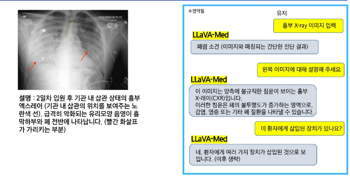
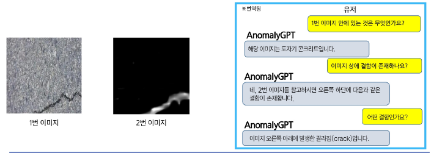
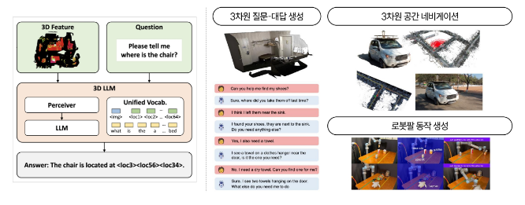

# LLaVA(Large Language and VIsion Assistant)
- Vision과 Language모델을 결합한 모델(VLM)로, 텍스트와 이미지를 동시에 이해
- 주요 특징
    - 이미지 인식과 텍스트 생성을 결합하여, 이미지 설명 생성 또는 시각적 질문 응답 작업에서 뛰어난 성능
    - 이미지, 명령(Instruction), 답변이 주어진 데이터셋을 구축하여 Instruction tuning으로 학습
- 응용 사례
    - 이미지 기반 질문 응답(Visual QA), 이미지 설명 생성, 시각적 정보 기반 대화
- LLaVA 모델 특징
    - 효율적인 메모리 사용 : 적은 자원으로 큰 모델을 효과적으로 학습
    - 다중 모달 학습 : 텍스트와 시각 데이터를 결합하여 응답을 생성
    - Fine-tuning : 특정 작업에 맞춰 모델을 미세조정하여 사용

# Step 1 : 사전학습(Pre-training)
- 표현 공유
    - 이미지를 텍스트 표현을 변환하는 선형 레이어(Projection layer)를 학습하여 텍스트와 이미지를 공통된 토큰 표현으로 처리
    - 전체 모델을 다시 훈련하지 않으므로 자원과 시간 절감
- 효율적인 학습
    - 적은 파라미터만(Projection layer) 학습

# Step 2 : Fine-tuning
- 표현 공유
    - 특정 작업에 맞춰 선형 레이어와 언어 모델 등 필요한 부분만 미세 조정으로 강화
- 효율적인 학습
    - FP16과 같은 정밀도 최적화를 통해 적은 메모리로 큰 모델 학습 가능
    - 저비용 학습 기법을 통해 메모리 사용량 절감

# 최신 공개 VLM 모델들 - Qwen-VL(ALibaba)
- 사용 VLM에 맞서는 오픈소스 VLM
    - Qwen-VL은 알리바바에서 개발한 대형 멀티모달 모델
    - Qwen-LM이라는 텍스트기반 대형 언어 모델(LLM)에 시각 처리 능력을 부여해 이미지와 텍스트를 동시에 이해하는 모델
    - 여러 개의 이미지 입력, 번역, 텍스트읽기, 위치찾기(물체 탐지), 인식, 이해 능력이 있음
- 학습 파이프라인
    - 사전학습 2단계와, 명령어 파인튜닝(instruction fine-tuning)까지 3단계로 구성
    - 대규모 웹 이미지-텍스트 쌍으로 시각 인코더와 어댑터 중심 최적화를 통해 기초적인 시각-언어 대응을 학습

# 최신 공개 VLM 모델들 - Qwen2-VL
- 확장 기능
    - 다국어 텍스트 및 이미지 내 텍스트 이해 지원
    - 임의의 이미지 해상도 처리 가능
    - Agent 응용 기능
    - 그 외 Code/math 추론, Video 분석, Live chat 기능 등 강화
- M-RoPE
    - 1D 텍스트, 2D 시각, 3D 비디오 위치 민감 정보를 부여할 수 있는 Multimodal Rotary Position Embedding을 사용

# 최신 공개 VLM 모델들 - Qwen2.5-VL
- 확장 기능
    - 강력한 문서 파싱 기능
        - 다국어 OCR
        - 테이블, 차트, 공식, 악보 이해
        - 필기체 이해
    - 정밀한 객체 그라운딩
        - 객체 탐지, 카운팅 능력 향상
    - 장시간 비디오 이해
        - 초단위 이벤트 세그먼트 추출 가능

# 최신 공개 VLM 모델들 - Qwen2.5-Omni
- Omni : 라틴어의 접두사. 모든(all), 전부(every), 전체(whole)
- 멀티모달 언어모델 분야에서의 Omni: 읽고, 쓰고, 보고, 듣고, 말하면 Omni

# 최신 공개 VLM 모델들 - InternVL
- 상용 VLM에 맞서는 오픈소스 VLM
    - OpenGBLab에서 개발한 멀티모달 언어모델
    - InternVL 1.0 부터 시작하여 현재 InternVL 2.5까지 발전
- InternVL 학습 전략
    - (a) 단일 모델 학습 파이프라인
    - (b) LLM을 점점 키워가면서 학습하는 파이프라인

# VLM의 성능을 높이는 트릭
- Set of Mark (SoM)
    - 다른 물체 탐지, 세그멘테이션 파운테이션 모델을 활용한 방법
    - VLM 모델들의 부족한 시각 능력을 보완하여 비약적 성능 향상
    - COmputer 작동 Agent 모델에 기본적인 비주얼 프롬프팅으로 매우 유용

# 도메인 특화 파운데이션 모델들 - 의료
- 의료 이미지(X-Ray, MRI, CT 등)를 입력 받아, 병적 진단 및 원인 설명 등의 테스크 수행
- Contrastive learning을 통해 학습
    - BiomedCLIP 모델 구조
- MedCLIP
    - 의료 텍스트와 이미지 임베딩을 정합시킨 의료용 CLIP 모델
    - 텍스트 입력으로부터 이미지 상의 질병을 탐지하거나 특정 종류의 의료 이미지를 검색하는 방식 등으로 활용 가능
- LLaVA-Med
    - LLaVA를 의료 데이터에 파인튜닝한 의료 특화 모델
    - 의료 이미지를 포함한 지시문 데이터(visual instruction-followingdate)를 통해 의료 이미지 기반 챗봇 대화가 가능한 멀티 모달

# 도메인 특화 파운데이션 모델들 - 제조업
- AnomalyGPT
    - 제조업 환경에서 발생하는 결합이나 불량을 탐지(anomaly detecion)하기 위한 모델
    - 챗봇 형식으로 이미지 상 결함에 대해 텍스트로 질의응답을 주고 받을 수 있음
    - ImageBind의 이미지 인코더와 Vicuna를 언어 모델로 활용하여 제조업 데이터에 파인튜닝

# 도메인 특화 파운데이션 모델들 - 3D 언어 모델
- 3차원 표현(예: point-cloud)과 자연어의 관계를 학습한 파운데이션 모델
    - 3D LLM 모델 구조

# 도메인 특화 파운데이션 모델들 - 로봇 행동 모델
- 입력 : 사람의 텍스트 명령 + 로봇 시점 영상
- 출력 : 로봇 행동 = {위치 변화, 관절 움직임}
- 텍스트 명령 기반 로봇 동작 예시

# 요약 및 정리
- CLIP의 학습 디자인 한계를 간파한 SigLIP
- VLM = Vision-Language Encoder(예: CLIP/SigLIP) + Language Model
    - 비전 입력은 눈에 해당하는 지각 기능, 언어 기반의 LLM은 뇌의 사고에 해당하는 중추 역할 수행
- 기존 언어모델은 텍스트만, CV모델은 이미지만 처리하기 때문에 이를 융합하면 수많은 문제들을 하나의 모델로 해결 가능
    - 이미지 인식, 탐지, 카운트, Visual Q&A, 추론, 글자인식(OCR), 번역, 추론, etc.
    - 도메인 특화 VLM 사례들
- 심화 CLIP 응용으로 추가 데이터 및 학습 없이 새로운 응용 모델을 만드는 디자인 패턴 (역전파 응용)