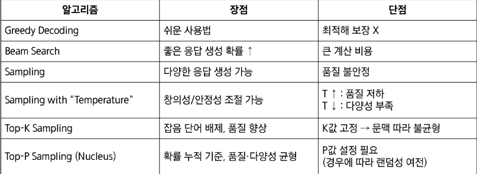

# 거대언어 모델의 추론
## 디코딩 알고리즘
- 거대 언어 모델의 자동회귀 생성 (Auto-regressive Generation)
- 학습이 완료된 거대 언어 모델은 어떻게 응답을 생성할까? -> 순차적 추론을 통한 "토큰별 생성"
- Q. 언제 추론 및 토큰 생성을 멈추고 응답을 제공? A. EOS 토큰 생성 시 종료 or 사전에 정의된 토큰 수 도달 시 종료
- Goal : 주어진 입력 x=[x1,...,xL]에 대한 다음 토큰 xL+1
    - Remark : 거대 언어 모델 -> 입력 x에 대해 다음 토큰에 대한 확률 분포 p(x)를 제공
- 디코딩(Decoding) 알고리즘 : p(x)로부터 xL+1을 생성하는 알고리즘 (다음 단어를 선택하는 방법)

# 디코딩(Decoding) 알고리즘 : 1 - Greedy Decoding
- 핵심 아이디어 : 가장 확률이 높은 다음 토큰을 선택
    - 장점 : 사용하기 쉽다
    - 단점 : 직후만 고려하기 때문에 생성 응답이 최종적으로 최선이 아닐 수 있다

# 디코딩(Decoding) 알고리즘 : 2 - Beam Search
- 핵심 아이디어 : 확률이 높은 k개(beam size)의 후보를 동시에 고려
    - 고르는 기준 : 누적 생성 확률(지금까지 생성한 문장 전체가 나올 확률의 곱)
    - 앞선 Greedy Decoding은 매 시점마다 가장 높은 확률의 선택지 1개만을 선택했지만, Beam Search는 전체 문장 후보들의 누적 확률을 기준으로 상위 k개를 남기는 것
    - 장점 : 최종적으로 좋은 응답생성 확률이 높다
    - 단점 : 계산 비용이 많이 늘어난다(각 후보마다 LLM추론을 수행)

# 디코딩(Decoding) 알고리즘 : 3 - Sampling
- 핵심 아이디어 : 거대 언어 모델이 제공한 확률을 기준으로 랜덤하게 생성
    - 장점 : 다양한 응답을 생성 할 수 있음
    - 단점 : 생성된 응답의 품질이 감소 할 수 있음

# 디코딩(Decoding) 알고리즘 : 4 - Sampling "with Temperature"
- 핵심 아이디어 : 하이퍼 파라미터 T를 통해 거대 언어 모델이 생성한 확률 분포를 임의로 조작
    - T > 1 : 확률 분포를 Smooth하게 만듦(더 다양한 응답 생성), 모델이 예측 할 때 다양성이 극대화되지만, 품질은 불안정, 창의적이나 품질이 떨어 질 수 있음
    - T < 1 : 확률 분포를 Sharp하게 만듦(기존에 확률이 높은 응답에 집중), 모델이 항상 비슷한 답(가장 높은 확률의 단어)만 내놓게 됨, 안정적이나 다양성이 떨어짐

# 디코딩(Decoding) 알고리즘 : 5 - Top-K Sampling
- 핵심 아이디어 : 확률이 높은 K개의 토큰들 중에서만 랜덤하게 확률에 따라 샘플링
    - 장점 : 품질이 낮은 응답을 생성할 가능성을 줄일 수 있음
    - 단점 : 확률 분포의 모양에 상관 없이 고정도니 k개의 후보군을 고려

# 디코딩(Decoding) 알고리즘 : 6 - Top-P Sampling (or Nucleus Sampling)
- 핵심 아이디어 : K를 고정하는 대신, 누적 확률(P)에 집중하여 K를 자동으로 조절
- 다양한 평가 지표에서 기존 디코딩 알고리즘들 대비 좋은 성능을 달성

# 디코딩(Decoding) 알고리즘 별 장단점 요약

--
# 프롬프트 엔지니어링
- 입력 프롬프트 = 1. 지시(instruction) + 2. 예시(few-shot examples)
    - 어떻게 지시를 주는지, 어떤 예시를 보여주는지가 거대 언어 모델의 성능에 크게 영향을 미침
    - 프롬프트 엔지니어링 : 원하는 답을 얻기 위해 모델에 주어지는 입력(프롬프트)을 설계,조정하는 기법

# 프롬프트 엔지니어링: 지시(instruction)
- 감정 분류와 같은 쉬운 문제 뿐만 아니라 수학, 코딩과 같은 어려운 문제를 거대 언어 모델로 푸는 것에 많은 관심 집중

# Chain-of-Thought (CoT) 프롬프팅
- 아이디어 : 단순히 질문과 응답만을 예시로 활용하는 것이 아니라, 추론(Reasoning) 과정도 예시에 포함
    - 이를 통해, 테스트 질문에 대해 추론을 생성하고 응답하도록 유도함으로써, 더 정확한 정답 생성을 기대할 수 있음
- 결과 : CoT는 거대 언어 모델(PaLM)의 추론 성능을 크게 증가시킴
    - PaLM : 당시 구글에서 사용했던 가장 큰 거대 언어 모델(PaLM(540B) vs GPT-3(175B))
- CoT로 인한 성능 향상은 모델 크기가 커질 수록 더 확대됨 (추론 ~= 창ㅂ라성?)
    - 창발성: 모델 크기가 커지면 갑자기 새로운 능력이 나타나는 현상을 의미 (PaLM의 창발적 능력이 발현되었을수 있음)
- 다른 추론 테스크 : 마지막 단어 연결
    - In-domain: 예시도 2단어, 테스트도 2단어 / Out-of-domain: 예시는 2단어, 테스트는 4단어
- 예시 기반 CoT는 강력하지만, 예시를 위한 추론 과정을 수집해야 되는 문제가 있음
- Q. 예시 없이도 (0-shot) 거대 언어 모델의 추론 성능을 강화할 수 있을까 (i,e..,0-shot CoT)?

# 0-shot CoT 프롬프팅
1. 유인 문장을 통한 추론 생성 (e.g. Let's think step by step)
2. 주어진 질문과 생성된 추론을 통한 정답 생성 (e.g. Therefore, the answer is)
- 결과 : 0-shot CoT는 기존 0-shot 프롬프팅보다 훨씬 높은 추론 성능을 달성
- 또한, 0-shot CoT는 모델 크기가 임계점을 넘어서야 효과성이 발휘